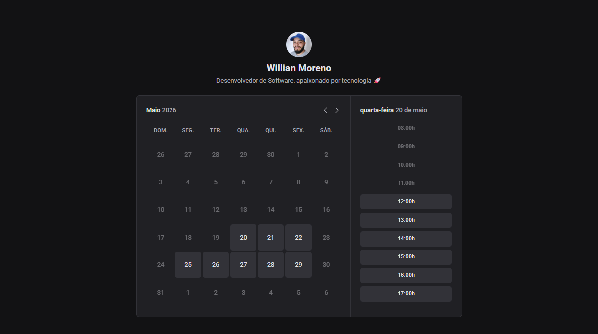

Eae, Dev! 👊🏾

Seja bem vindo(a) ✨🚀

<h1 align="center">Ignite Call</h1>
<h3 align="center">Formação React - Rocketseat</h3>

    <a href="#-sobre">Sobre</a>&nbsp;&nbsp;&nbsp;|&nbsp;&nbsp;&nbsp;
    <a href="#-tecnologias">Tecnologias</a>&nbsp;&nbsp;&nbsp;|&nbsp;&nbsp;&nbsp;
    <a href="#-layout">Layout</a>&nbsp;&nbsp;&nbsp;|&nbsp;&nbsp;&nbsp;
    <a href="#-licença">Licença</a>&nbsp;&nbsp;&nbsp;|&nbsp;&nbsp;&nbsp;
    <a href="#-acesse-o-rocketseat-one">Acesse o Rocketseat One</a>

    

    

<h3>📌 Sobre</h3> 

A Ignite Call é um calendário no qual é possível conectar a conta Google, configurar dias e horários específicos para que outras pessoas marquem um horário na agenda. Ela explora as funcionalidades do Next.js, rotas autenticadas, integração com o Google Calendar, validações, uso do prisma para transações SQL, React Query e muito mais.

<h3>📌 Tecnologias</h3> 

- Next.js;
- Google Calendar;
- React Query;
- Axios;
- Date Fns;
- Nookies;
- Phosphor React;
- Zod;
- Prisma;
- TypeScript;
- HTML, CSS, JavaScript;
- Git;
- Figma;

<h3>📌 Layout</h3>

Você pode visualizar o layout do projeto através [DESSE LINK](https://www.figma.com/design/EodB45uOEVn5phO06D5ILa/Ignite-Call--Community-?node-id=0-1&p=f&t=USVk2IRcPIkHbQjJ-0). É necessário ter conta no [Figma](https://figma.com) para acessá-lo.

<h3>📌 Licença</h3>

Esse projeto está sob a licença MIT.

<h3>📌 Acesse o Rocketseat One</h3>

[Rocketseat One](https://app.rocketseat.com.br/cart/rocketseat-one?referral=willian-moreno&utm_source=platform&utm_medium=organic&utm_campaign=venda&utm_term=mgm&utm_content=indication-lp_one)